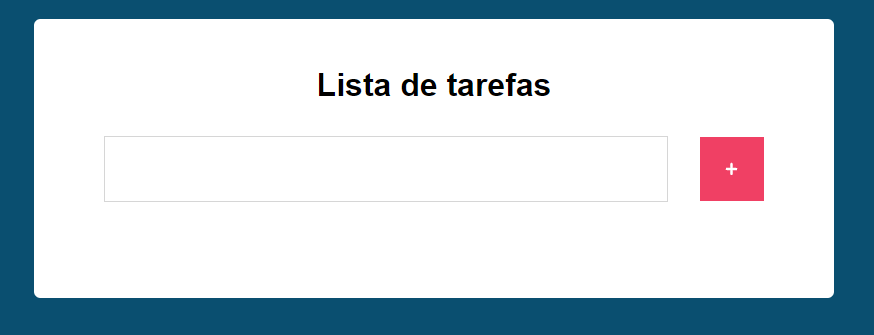
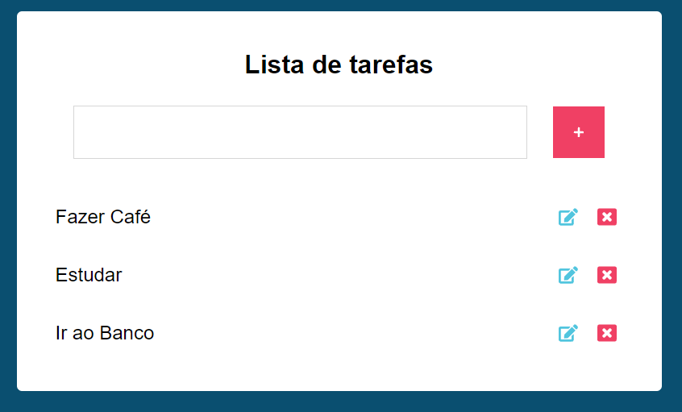

# Porjeto lista de tarefas com React Js

## Minha aplicação:

## tecnologias usadas no sistema:

<ul>
  <li>HTML5</li>
  <li>CSS</li>
  <li>JavaScript</li>
  <li>React Js</li>
</ul>

## Sobre a aplicação:

Esse sistema faz uma lista de tarefas que possui as funções de editar e exclir cada item da lista, akém disso esse projeto
salva todos os itens criados no localStorage.

## Por que esse sistema:

Essa aplicação foi criado para aprender e praticar React Js e para desenvolvimento do portfólio pessoal.

## Ficaria feliz com feedbacks:
linkdin: https://www.linkedin.com/in/raphaellima98/  
Email: raphaeldesousalm@gmail.com
